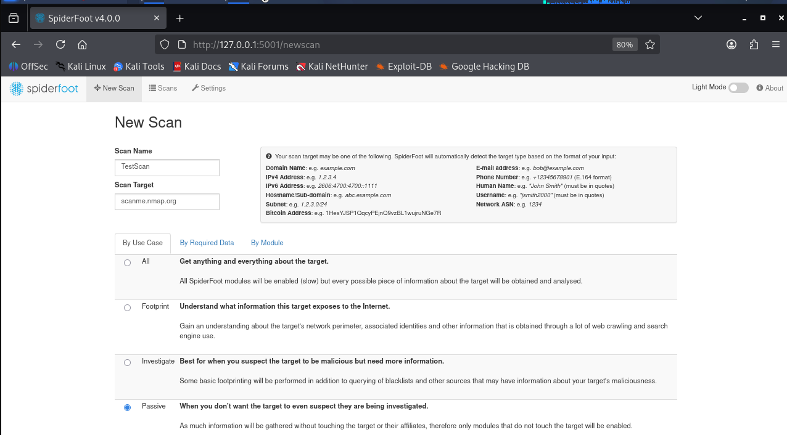
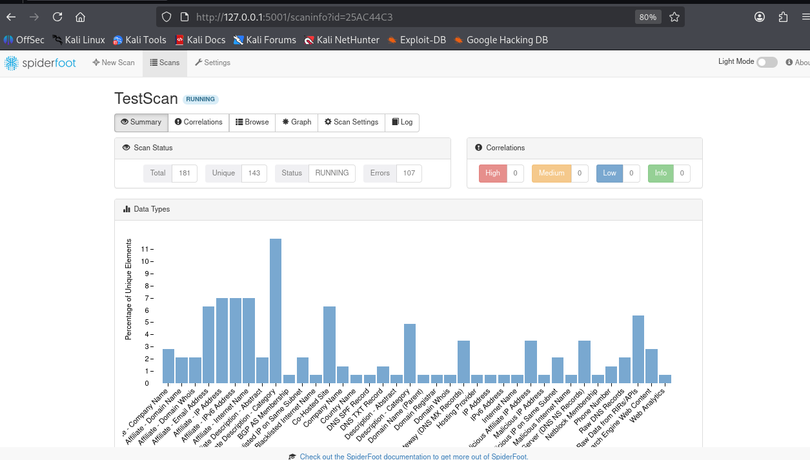
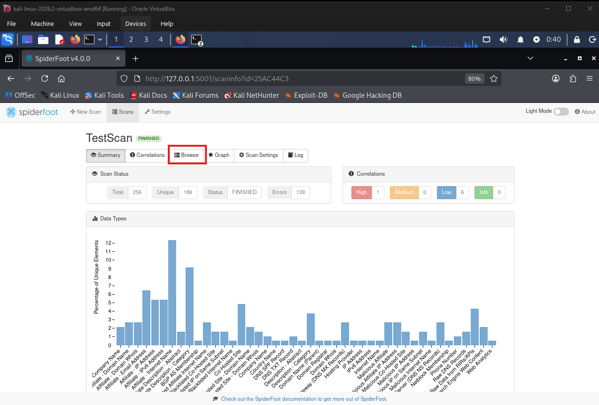
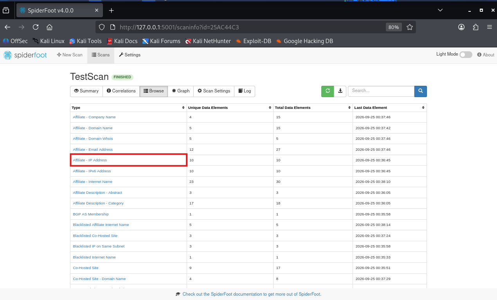

# 🔎 SpiderFoot Passive OSINT Lab

A hands-on OSINT lab using SpiderFoot on Kali Linux to explore passive reconnaissance, infrastructure discovery, data correlation, and relationship mapping.

## Overview

This project documents a hands-on OSINT lab I completed using **SpiderFoot on Kali Linux**.

The goal was to explore how an automated OSINT tool can start with a single domain and correlate publicly available information from multiple sources.

Rather than simply running a scan, I wanted to examine what SpiderFoot discovered, understand how different entities were connected, and see where analyst validation becomes necessary.

### Lab Environment

- **Operating System:** Kali Linux
- **OSINT Tool:** SpiderFoot 4.0.0
- **Virtualization:** VirtualBox
- **Target:** `scanme.nmap.org`
- **Scan Type:** Passive

The exercise was limited to passive information gathering.

---

## 1. Installing SpiderFoot

I started by installing SpiderFoot from the Kali Linux repositories.

```bash
sudo apt update
sudo apt install spiderfoot -y
```


---

## 2. Starting SpiderFoot

I launched the local SpiderFoot web interface with:

```bash
spiderfoot -l 127.0.0.1:5001
```

The interface was then available locally at:

```text
http://127.0.0.1:5001/
```


---

## 3. SpiderFoot Dashboard

After starting the server, I accessed the SpiderFoot interface through Firefox.

From here, scans can be created, targets configured, scan types selected, and collected OSINT data reviewed.


---

## 4. Configuring the Passive Scan

The target used for this lab was:

```text
scanme.nmap.org
```

I selected SpiderFoot's **Passive** use case.

The objective was to gather information through passive sources rather than intentionally performing active reconnaissance against the target.



---

## 5. Running the Scan

Once the scan was started, SpiderFoot began collecting and correlating information from its available passive sources.

As the scan progressed, different entities and relationships associated with the starting domain began appearing.



---

## 6. Scan Results

The completed scan returned:

- **256 total data elements**
- **186 unique data elements**
- **139 errors**

The collected data included categories such as:

- Domain and internet names
- IPv4 addresses
- IPv6 addresses
- Email addresses
- DNS-related information
- BGP/AS information
- Co-hosted sites
- Related infrastructure



The volume of results demonstrated one of the benefits of automated OSINT: a tool can collect and correlate a significant amount of information quickly.

However, the quantity of results does not necessarily indicate their relevance or accuracy. Individual findings still need to be examined in context.

---

## 7. Investigating Infrastructure

Instead of stopping at the scan summary, I explored individual result categories.

One category I examined was **Affiliate - IP Address**.

SpiderFoot reported relationships between discovered hostnames and IP addresses. Examples from the scan included:

```text
aspmx2.googlemail.com      → 142.250.147.26
alt1.aspmx.l.google.com    → 142.250.147.27
aspmx.l.google.com         → 142.251.127.26
aspmx3.googlemail.com      → 142.251.127.27
alt2.aspmx.l.google.com    → 172.253.152.26
```



These results demonstrate how SpiderFoot can expand an investigation from a single starting point into additional hostnames, IP addresses, and infrastructure relationships.

At this stage, these are **tool-generated findings**. Manual validation would be required before treating important relationships as confirmed intelligence.

---

## 8. Reviewing a Blacklist Finding

Another result that caught my attention appeared under **Blacklisted Internet Name**.

SpiderFoot displayed:

```text
Comodo Secure DNS [scanme.nmap.org]
```

The result was generated by the module:

```text
sfp_comodo
```


This was a useful example of why automated findings need context.

A result appearing in a blacklist-related category should **not automatically be interpreted as proof that a domain is malicious**.

Before drawing a conclusion, an analyst should examine the source of the finding, understand what the module is reporting, check whether the information is current, and corroborate it with additional sources where appropriate.

---

## 9. Relationship Mapping

SpiderFoot also provides a graph view for visualizing relationships between discovered entities.


The graph helped illustrate how quickly an investigation can expand from one starting point into multiple connected entities.

Conceptually:

```text
Starting Domain
      │
      ▼
Public Data Sources
      │
      ▼
Collected Entities
      │
      ├── Domains
      ├── Hostnames
      ├── IP Addresses
      ├── Email Infrastructure
      └── DNS / Network Data
      │
      ▼
Relationship Mapping
      │
      ▼
Analyst Review
```

The visualization is useful for exploring relationships, but the existence of an edge or relationship in an automated tool should still be understood and validated before drawing conclusions from it.

---

## What I Learned

My biggest takeaway from this lab was:

> **Automated OSINT findings are leads, not conclusions.**

SpiderFoot can automate a significant amount of collection and correlation, but automation does not replace analyst reasoning.

During an OSINT investigation, I need to consider:

- Where did this information come from?
- Which module generated the result?
- Why are these two entities connected?
- Is the information current?
- Can the relationship be independently validated?
- Is the finding actually relevant to the investigation?

This lab helped reinforce the difference between **collecting information** and **producing useful intelligence**.

```text
Collection
    │
    ▼
Correlation
    │
    ▼
Validation
    │
    ▼
Analysis
    │
    ▼
Useful Intelligence
```

---

## Limitations

The completed scan reported **139 errors**.

I have not yet investigated each error individually, so I am not assuming their cause.

A future step will be to review the relevant SpiderFoot output and modules to better understand which data sources failed and why.

This is also an important part of OSINT analysis: understanding not only what data was collected, but also where collection was incomplete or unsuccessful.

---

## Next Steps

I plan to continue the lab by:

- Manually validating DNS relationships using `dig`
- Exploring WHOIS data
- Exploring certificate transparency data
- Comparing SpiderFoot findings with another OSINT tool
- Investigating the scan errors
- Identifying potential false positives
- Exporting and analyzing collected results
- Developing a more repeatable OSINT investigation workflow

The next stage of the project will focus more heavily on validation:

```text
SpiderFoot Discovery
        │
        ▼
Manual Validation
        │
        ├── DNS
        ├── WHOIS
        └── Additional OSINT Sources
        │
        ▼
Corroborated Findings
        │
        ▼
Analyst Assessment
```

---

## Disclaimer

This project was completed for **educational and cybersecurity training purposes**.

OSINT and reconnaissance activities should only be performed within appropriate authorization and scope.
