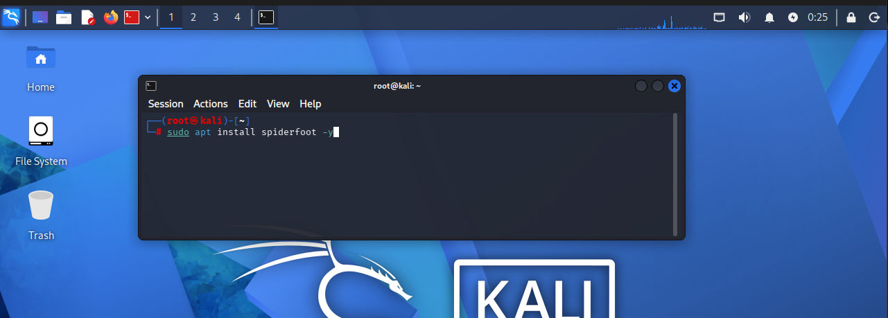
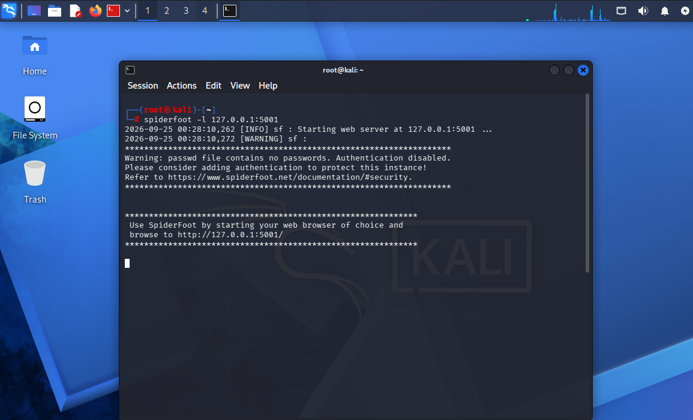
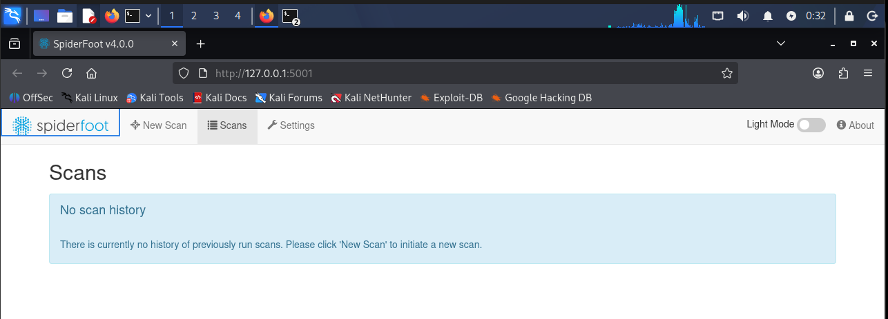
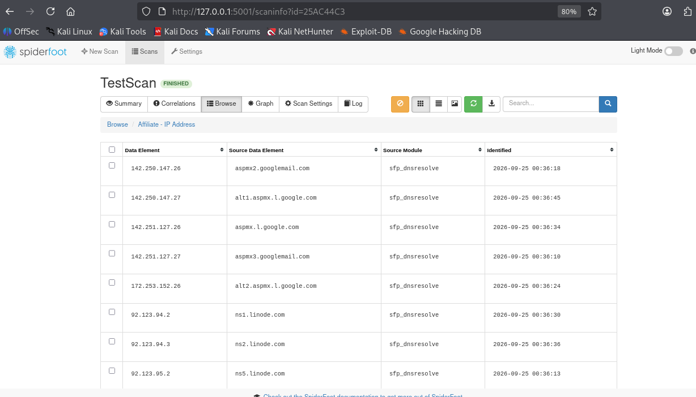
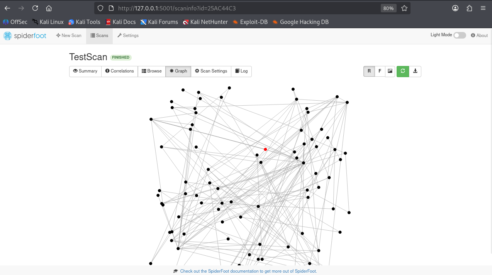

# 🔎 SpiderFoot Passive OSINT Lab

A hands-on OSINT lab using SpiderFoot on Kali Linux to explore passive reconnaissance, infrastructure discovery, data correlation, and relationship mapping.

## Overview

This project documents a small hands-on OSINT lab I completed using **SpiderFoot on Kali Linux**.

The goal was to understand how an automated OSINT tool can start with a single domain and collect and correlate publicly available information from multiple sources.

Rather than simply running the tool, I wanted to understand what SpiderFoot was discovering, how different pieces of infrastructure were connected, and why automated findings still require analyst validation.

For this lab, I used:

- **Kali Linux**
- **SpiderFoot 4.0.0**
- **VirtualBox**
- **Target:** `scanme.nmap.org`
- **Scan Type:** Passive

The exercise was limited to passive information gathering.

---

## 1. Installing SpiderFoot

I started by installing SpiderFoot from the Kali Linux repositories.

```bash
sudo apt update
sudo apt install spiderfoot -y
```



---

## 2. Starting SpiderFoot

SpiderFoot provides a web interface that can be hosted locally.

I started the server using:

```bash
spiderfoot -l 127.0.0.1:5001
```

The interface was then available locally at:

```text
http://127.0.0.1:5001/
```



---

## 3. SpiderFoot Dashboard

After starting the local server, I accessed the SpiderFoot web interface through Firefox.

This interface is used to create scans, configure targets, select scan types, and review collected OSINT data.



---

## 4. Configuring the Passive Scan

For this lab, the target was:

```text
scanme.nmap.org
```

I selected SpiderFoot's **Passive** use case.

The purpose was to collect information from public and third-party sources without intentionally performing active reconnaissance against the target.


---

## 5. Running the Scan

Once configured, SpiderFoot began querying its available passive data sources and correlating the information it discovered.

The scan gradually built a collection of entities and relationships associated with the starting domain.


---

## 6. Scan Results

The completed scan returned:

- **256 total data elements**
- **186 unique data elements**

The results included multiple types of publicly available information, such as:

- Domain and internet names
- IPv4 addresses
- IPv6 addresses
- Email addresses
- DNS-related infrastructure
- BGP/AS information
- Co-hosted infrastructure
- Other related entities


One important observation from the scan was that automated OSINT can produce a large amount of data very quickly.

The challenge is determining which results are actually useful and understanding why they were associated with the original target.

---

## 7. Investigating Infrastructure

I then explored individual results rather than relying only on the overall scan summary.

One category I examined was **Affiliate - IP Address**.

SpiderFoot correlated discovered hostnames with IP addresses, including mail-related infrastructure associated with `nmap.org`.

Examples observed during the scan included:

```text
aspmx2.googlemail.com      → 142.250.147.26
alt1.aspmx.l.google.com    → 142.250.147.27
aspmx.l.google.com         → 142.251.127.26
aspmx3.googlemail.com      → 142.251.127.27
alt2.aspmx.l.google.com    → 172.253.152.26
```


This demonstrated how a single starting domain can lead to additional infrastructure through DNS resolution and other public relationships.

---

## 8. Reviewing a Blacklist Finding

Another result that caught my attention appeared under **Blacklisted Internet Name**.

SpiderFoot displayed:

```text
Comodo Secure DNS [scanme.nmap.org]
```

The result was generated by the SpiderFoot module:

```text
sfp_comodo
```



This was a useful example of why automated OSINT findings need context.

A result appearing under a blacklist-related category should **not automatically be interpreted as proof that the target is malicious**.

Instead, the analyst should review the source, module, context, and ideally validate the finding independently before reaching a conclusion.

---

## 9. Relationship Mapping

One of the most interesting SpiderFoot features in this lab was its relationship graph.

The graph provides a visual representation of connections between discovered entities.



Conceptually, the investigation expanded like this:

```text
                    Starting Domain
                          │
              ┌───────────┼───────────┐
              │           │           │
             DNS         IPs        Mail
              │           │           │
              ▼           ▼           ▼
         Nameservers   Addresses    MX Hosts
              │           │           │
              └───────────┼───────────┘
                          │
                          ▼
                Related Infrastructure
```

This helped me see how information gathered from different sources can be connected to build a broader picture of publicly visible infrastructure.

---

## What I Learned

The biggest takeaway from this lab was:

> **Automated OSINT findings are leads, not conclusions.**

SpiderFoot can automate a significant amount of information gathering and correlation, but the tool does not replace analyst reasoning.

A useful OSINT workflow requires understanding:

- Where the information came from
- Which module generated the finding
- Why two entities were connected
- Whether the information is current
- Whether the relationship can be independently validated
- Whether the finding is actually relevant to the investigation

The lab helped me think about the difference between simply **collecting information** and actually **analyzing intelligence**.

```text
Collection
    │
    ▼
Correlation
    │
    ▼
Validation
    │
    ▼
Analysis
    │
    ▼
Useful Intelligence
```

---

## Limitations

The completed scan also displayed **139 errors**.

I have not yet investigated each error individually, so I am not assuming their cause.

This is something I plan to examine further by reviewing SpiderFoot's module output and logs to understand which sources failed and why.

Documenting unsuccessful or incomplete collection is also important when evaluating the reliability of OSINT results.

---

## Next Steps

To continue developing this lab, I plan to explore:

- Manual DNS validation using `dig`
- WHOIS analysis
- Certificate transparency data
- Comparing SpiderFoot findings with another OSINT tool
- Investigating the scan errors
- Identifying potential false positives
- Exporting and analyzing SpiderFoot results
- Developing a repeatable OSINT investigation workflow

The next stage would move from automated discovery toward manual validation:

```text
SpiderFoot Discovery
        │
        ▼
Manual Validation
        │
        ├── DNS
        ├── WHOIS
        └── Additional OSINT Sources
        │
        ▼
Corroborated Finding
        │
        ▼
Analyst Assessment
```

---

## Disclaimer

This project was completed for **educational and cybersecurity training purposes**.

OSINT and reconnaissance activities should only be performed within appropriate authorization and scope.
